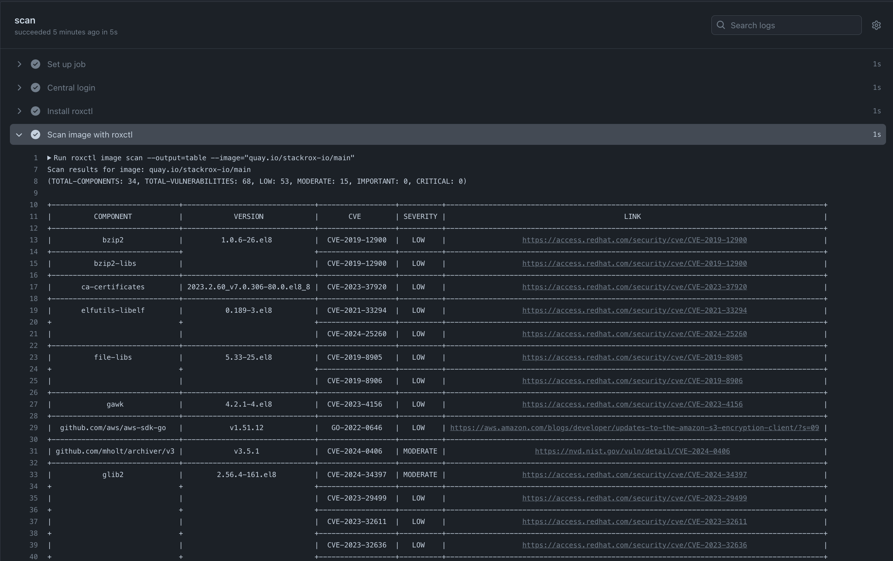
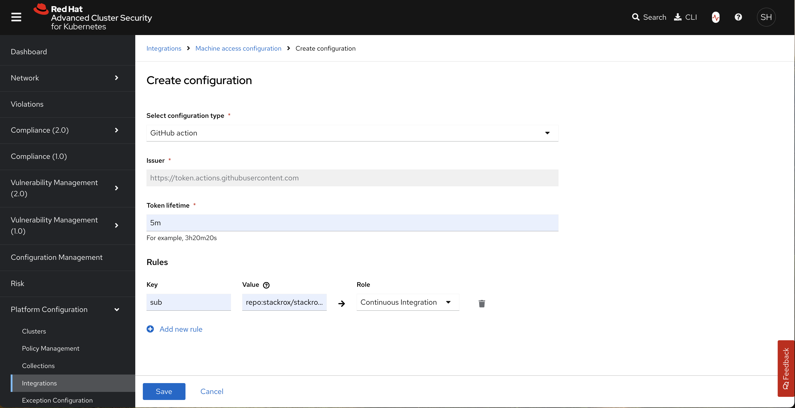

# roxctl-installer-action GitHub Action

This is a GitHub action for installing `roxctl` on Github Action runners. `roxctl` is a command-line interface (CLI) for running commands on Red Hat Advanced Cluster Security for Kubernetes ([RHACS](https://redhat.com/en/technologies/cloud-computing/openshift/advanced-cluster-security-kubernetes)).



## Table of Contents

- [Parameters](#parameters)
- [Authentication](#authentication)
  - [Authenticate with short-lived access tokens](#authenticate-with-short-lived-access-tokens)
  - [Authenticate with long-lived API tokens](#authenticate-with-long-lived-api-tokens)
- [Usage](#usage)
  - [Scan images in CI pipelines](#scan-images-in-ci-pipelines)
  - [Check images in CI pipelines](#check-images-in-ci-pipelines)
  - [Download roxctl from mirror.openshift.com](#download-roxctl-from-mirroropenshiftcom)
  - [GitHub code scanning](#github-code-scanning)

## Parameters

| Parameter name     | Required?  | Description                                                                                                                                                          |
| ------------------ | ---------- | -------------------------------------------------------------------------------------------------------------------------------------------------------------------- |
| `install-dir`      | (optional) | Path of directory to install `roxctl` to.                                                                                                                            |
| `version`          | (optional) | `roxctl` release version to use, e.g. "4.4.0". The latest available version is used by default. Ignored when `central-endpoint` is specified.                        |
| `central-endpoint` | (optional) | RHACS Central endpoint to download `roxctl` from. If left unspecified, `roxctl` is downloaded from mirror.openshift.com instead. Requires `central-token` to be set. |
| `central-token`    | (optional) | Token to access RHACS Central endpoint.                                                                                                                              |
| `skip-tls-verify`  | (optional) | Skip TLS certificate verification for Central's API endpoint. `false` by default.                                                                                    |

## Authentication

### Authenticate with short-lived access tokens

Short-lived access tokens are the recommended authentication method when using `roxctl` in GitHub workflows.
To generate a suitable token, configure a machine access configuration in Central and run the
[central-login](https://github.com/stackrox/central-login) Github Action to set up an authenticated environment.

For example, to allow access from GitHub workflows in the `stackrox/stackrox` repository:

1. Create a machine access configuration of type `GitHub` in Central.
2. Add a new rule with `Key = sub`, `Value = repo:stackrox/stackrox.*` and `Role = Continuous Integration`.



The following examples assume `env.CENTRAL_ENDPOINT=https://my-central.com` to be a valid Central URL.

See [Scan images in CI pipelines](#scan-images-in-ci-pipelines) and [Check images in CI pipelines](#check-images-in-ci-pipelines) for full length examples.

```yaml
steps:
  - name: Central login
    uses: stackrox/central-login@v1
    with:
      endpoint: ${{ env.CENTRAL_ENDPOINT }}
  - name: Install roxctl
    uses: stackrox/roxctl-installer-action@v1
    with:
      central-endpoint: ${{ env.CENTRAL_ENDPOINT }}
      central-token: ${{ env.ROX_API_TOKEN }}
```

### Authenticate with long-lived API tokens

Long-lived API tokens are not recommended because they carry an increased risk of credential exposure.
They should only be used when short-lived access tokens are not an option.

To authenticate with a Central API token, create a GitHub secret `secrets.ROX_API_TOKEN` and assign its value to the API token.

```yaml
name: Scan image with roxctl
on:
  push:
    branches: ["main"]
  pull_request:
jobs:
  scan:
    runs-on: ubuntu-latest
    permissions:
      id-token: write
    steps:
      - name: Install roxctl
        uses: stackrox/roxctl-installer-action@v1
        with:
          central-endpoint: ${{ env.CENTRAL_ENDPOINT }}
          central-token: ${{ secrets.ROX_API_TOKEN }}
      - name: Scan image with roxctl
        shell: bash
        env:
          ROX_ENDPOINT: ${{ env.CENTRAL_ENDPOINT }}
          ROX_API_TOKEN: ${{ secrets.ROX_API_TOKEN }}
        run: |
          roxctl image scan --output=table --image="quay.io/stackrox-io/main"
```

## Usage

### Scan images in CI pipelines

See [`roxctl image scan`](https://docs.openshift.com/acs/4.4/cli/command-reference/roxctl-image.html#roxctl-image-scan_roxctl-image)
for the full parameter list.

```yaml
name: Scan image with roxctl
on:
  push:
    branches: ["main"]
  pull_request:
jobs:
  scan:
    runs-on: ubuntu-latest
    permissions:
      id-token: write
    steps:
      - name: Central login
        uses: stackrox/central-login@v1
        with:
          endpoint: ${{ env.CENTRAL_ENDPOINT }}
      - name: Install roxctl
        uses: stackrox/roxctl-installer-action@v1
        with:
          central-endpoint: ${{ env.CENTRAL_ENDPOINT }}
          central-token: ${{ env.ROX_API_TOKEN }}
      - name: Scan image with roxctl
        shell: bash
        run: |
          roxctl image scan --output=table --image="quay.io/stackrox-io/main"
```

### Check images in CI pipelines

See [`roxctl image check`](https://docs.openshift.com/acs/4.4/cli/command-reference/roxctl-image.html#roxctl-image-check_roxctl-image)
for the full parameter list.

```yaml
name: Check image with roxctl
on:
  push:
    branches: ["main"]
  pull_request:
jobs:
  check:
    runs-on: ubuntu-latest
    permissions:
      id-token: write
    steps:
      - name: Central login
        uses: stackrox/central-login@v1
        with:
          endpoint: ${{ env.CENTRAL_ENDPOINT }}
      - name: Install roxctl
        uses: stackrox/roxctl-installer-action@v1
        with:
          central-endpoint: ${{ env.CENTRAL_ENDPOINT }}
          central-token: ${{ env.ROX_API_TOKEN }}
      - name: Check image with roxctl
        shell: bash
        run: |
          roxctl image check --output=table --image="quay.io/stackrox-io/main"
```

### Download roxctl from mirror.openshift.com

See [`roxctl image scan`](https://docs.openshift.com/acs/4.4/cli/command-reference/roxctl-image.html#roxctl-image-scan_roxctl-image)
for the full parameter list.

```yaml
name: Scan image with roxctl
on:
  push:
    branches: ["main"]
  pull_request:
jobs:
  scan:
    runs-on: ubuntu-latest
    permissions:
      id-token: write
    steps:
      - name: Central login
        uses: stackrox/central-login@v1
        with:
          endpoint: ${{ env.CENTRAL_ENDPOINT }}
      - name: Install roxctl
        uses: stackrox/roxctl-installer-action@v1
        with:
          version: 4.4.0
      - name: Scan image with roxctl
        shell: bash
        run: |
          roxctl image scan --output=table --image="quay.io/stackrox-io/main"
```

### GitHub code scanning

See [`roxctl image scan`](https://docs.openshift.com/acs/4.4/cli/command-reference/roxctl-image.html#roxctl-image-scan_roxctl-image)
for the full parameter list.

```yaml
name: Code scanning with roxctl
on:
  push:
    branches: ["main"]
  pull_request:
jobs:
  scan:
    runs-on: ubuntu-latest
    permissions:
      id-token: write
      security-events: write
    steps:
      - name: Checkout
        uses: actions/checkout@v4
      - name: Central login
        uses: stackrox/central-login@v1
        with:
          endpoint: ${{ env.CENTRAL_ENDPOINT }}
      - name: Install roxctl
        uses: stackrox/roxctl-installer-action@v1
        with:
          central-endpoint: ${{ env.CENTRAL_ENDPOINT }}
          central-token: ${{ env.ROX_API_TOKEN }}
      - name: Scan image with roxctl
        shell: bash
        run: |
          roxctl image scan --output=sarif --image="quay.io/stackrox-io/main" > results.sarif
      - name: Upload roxctl scan results to GitHub code scanning
        uses: github/codeql-action/upload-sarif@v3
        with:
          category: stackrox-io/main
          sarif_file: results.sarif
```
